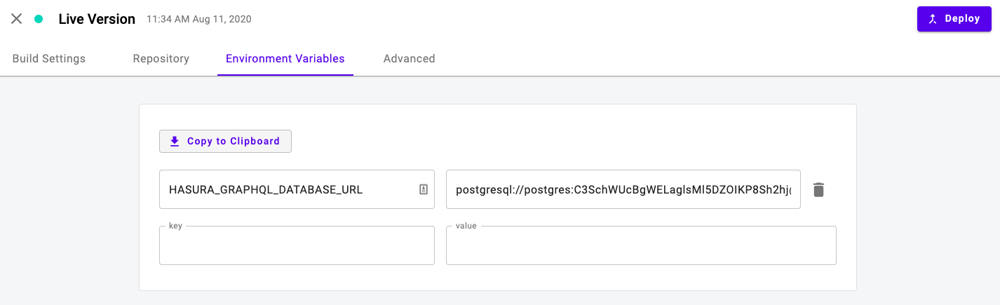
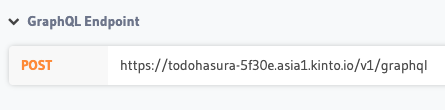

This example will walk through putting together a full stack app on KintoHub from the ground up and will take about 15 minutes.
If you are interested in a quick single service, check out our list of [examples](examples/nodejs/nodejs-example).

This example will deploy a **Todo List App** using `React`, `Hasura` and `Postgres` all within KintoHub's free tier.

## Create a KintoHub Account

If you have not created a KintoHub account yet, please to create one [here](https://app.kintohub.com).

## Deploy a Postgres Server

To store our data, we will need a Postgres database.
KintoHub provides a dedicated Postgres server with 1 Gb of storage.

1. Click the **Create Service** At the top right of your environment
2. Click the **From Catalog** tab
3. Click **PostgreSQL**
4. Enter or generate your `Username`, `Password`, and `Root Password`.
5. Click **Deploy** At the top right.

This process will take around **1 Minute** to complete.
Once the **Status** has changed from `Deploying` to `Live Version`, click on the **Access** tab at the top center of the page.

Copy the **Connection String (Admin)** and paste it in a notepad to use for the next step.

## Deploy a Hasura Service

This tutorial has a premade Hasura repository with migration files available.
You can deploy it with the following steps:

1. Click on **Create Service** at the top right
2. Click **Web App**
3. Copy and paste the following into the **Repository URL** `https://github.com/kintohub/todo-hasura`
4. Click **Connect**
5. Type `Dockerfile` in the **Dockerfile Name** field
6. Type `8080` in the **Port** field
7. Click the **Environment Variables** Tab
8. Add the **key** `HASURA_GRAPHQL_DATABASE_URL` and paste in the **Connection String (Admin)** from the previous step as the **value**
9. Click **Deploy** at the top right

This will take around **30 Seconds** to complete.
Once complete, you can click the link to the right of **Public API access via**
You will now see Hasura's dashboard and can copy the **GraphQL Endpoint URL**

## Setup React Web App

This tutorial has a premade React Todo List App that works with Hasura.
You can deploy it with the following steps:

1. Click on **Create Service** at the top right
2. Click **Web App**
3. Copy and paste the following into the **Repository URL** `https://github.com/kintohub/todo-react`
4. Click **Connect**
5. Type `Dockerfile` in the **Dockerfile Name** field
6. Type `8080` in the **Port** field
5. Click on **Environment Variables** Tab
6. Add the **key** `REACT_APP_SERVER_URL` and paste the **GraphQL Endpoint URL** from the previous step as the **value**
7. Click **Deploy**

This will take around **3 Minutes** to complete.
Once complete, you can click the link to the right of **Public API access via**

## Optimize Cost

**Congratulations! You have finished the full stack tutorial.**

If you are on a paid account and have already used your monthly free credits, the total cost of this environment can be optimized to a max cost of **$4.34** USD per month.
To do this, update your services with the following:

* Lower the [memory](../anatomy/anatomy-advanced.md#memory) of **todo-hasura** from `256` to `128` MB of memory
* Lower the [memory](../anatomy/anatomy-advanced.md#memory) of **postgres** from `256` to `128` MB of memory
* Lower the [memory](../anatomy/anatomy-advanced.md#memory) of **todo-react** from `256` to `32` MB of memory 

